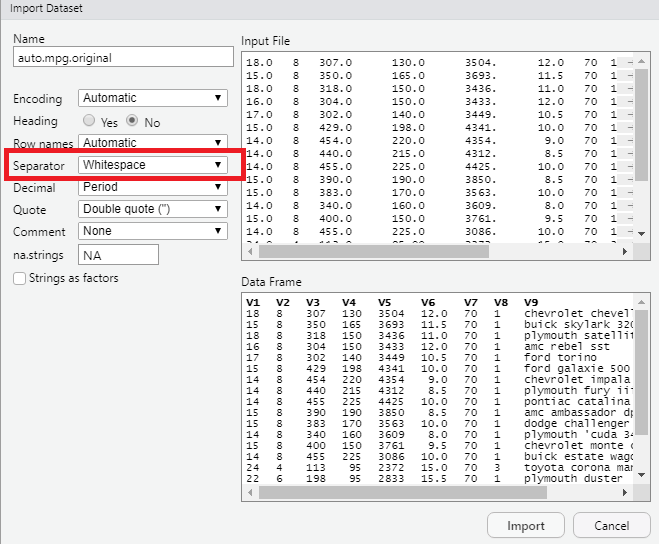
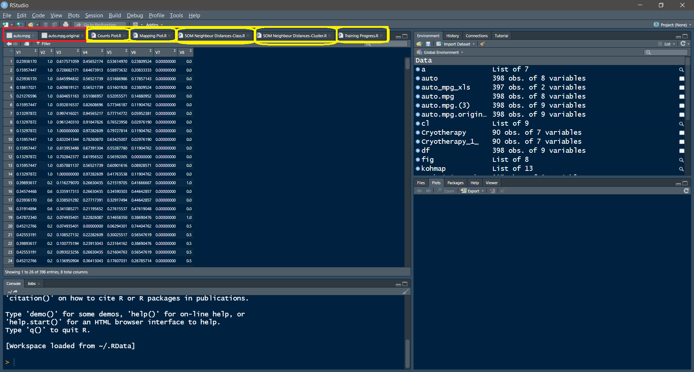
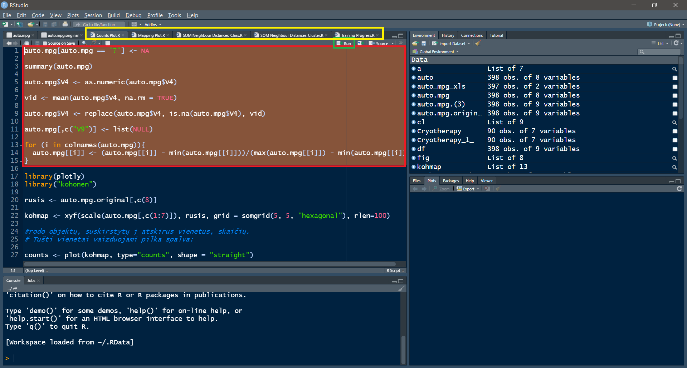
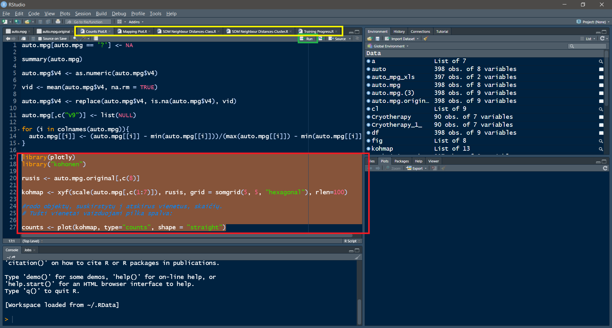

# RStudio
RStudio is an integrated development environment (IDE) for R. It includes a console, syntax-highlighting editor that supports direct code execution, as well as tools for plotting, history, debugging and workspace management.

    

# Self Organizing Map (SOM) - Neural Network
A self-organizing map (SOM) is a type of artificial neural network (ANN) that is trained using
unsupervised learning to produce a low-dimensional (typically two-dimensional), discretized representation 
of the input space of the training samples, called a map, and is therefore a method to do dimensionality reduction. 
Self-organizing maps differ from other artificial neural networks as they apply competitive learning as opposed to
error-correction learning (such as backpropagation with gradient descent), and in the sense that they use a neighborhood
function to preserve the topological properties of the input space.

    

#  USING Instruction Step by Step
 
## Open R Studio

## First of all, let's download and activate: Kohonen and Plotly package
 
## Now Import 2 our .data files (auto-mpg-original.data and auto-mpg.data) into project

## Make sure that on Separator section, you choices Whitespace 

    

## Now import one of .R Scripts into project
## (red color is our .data , yellow is our .R Scripts)

    

## Open Script file and run this red marked section, hat responsible for normalize data

    

## And now, after normalizing data, we can call the display section and perform a kohonen function

    

# Here each way examples

    <h2> Counts Plot </h2>
    

    <h2> Mapping Plot </h2>
    

    <h2> SOM-Neighbour-Distances-Class </h2>
    

    <h2> SOM-Neighbour-Distances-Cluster </h2>
    

